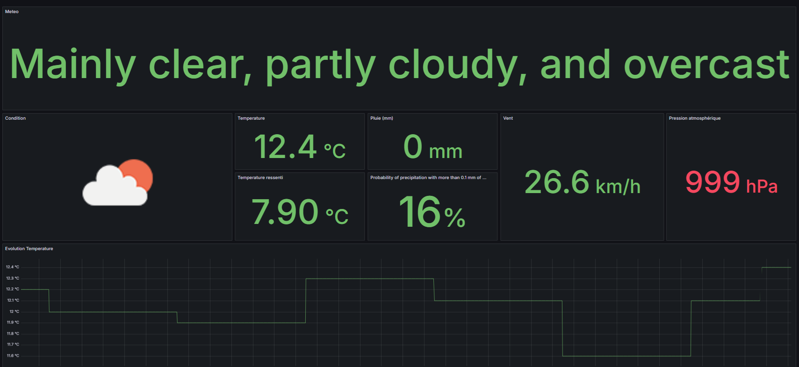

Personnal open-meteo.com exporter in Rust




## note to build for RPI 4

``` sh
sudo apt-get update
sudo apt-get install -y gcc-aarch64-linux-gnu
rustup target add aarch64-unknown-linux-gnu
cargo build --target aarch64-unknown-linux-gnu
cargo build --release --target aarch64-unknown-linux-gnu
``` 

